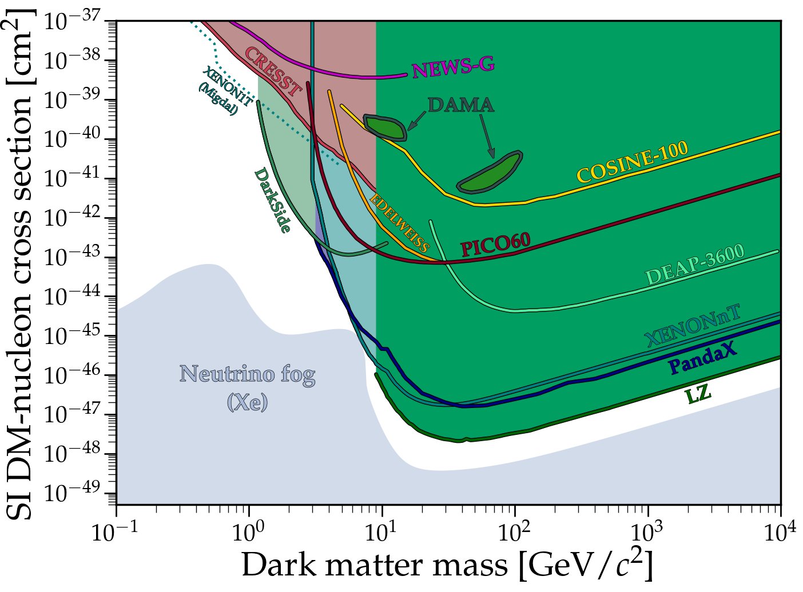

# DirectDetectionPlots

This repository is still under construction! Please email me if you spot errors or missing limits, and let me know if there are plots that I should include beyond what is shown here.

# Plots and notebooks
---

### DM-nucleon scattering (spin-independent)
### [View Notebook (.ipynb)](https://github.com/cajohare/DirectDetectionPlots/blob/main/notebooks/DM-Nucleon.ipynb)
### [Download (.pdf)](https://raw.githubusercontent.com/cajohare/DirectDetectionPlots/refs/heads/main/plots/Nucleon_SI.pdf)
### [Download (.png)](https://raw.githubusercontent.com/cajohare/DirectDetectionPlots/refs/heads/main/plots/plots_png/Nucleon_SI.png)
### &nbsp;
---

### DM-nucleon scattering (spin-dependent proton)
### [View Notebook (.ipynb)](https://github.com/cajohare/DirectDetectionPlots/blob/main/notebooks/DM-Nucleon.ipynb)
### [Download (.pdf)](https://raw.githubusercontent.com/cajohare/DirectDetectionPlots/refs/heads/main/plots/Nucleon_SDp.pdf)
### [Download (.png)](https://raw.githubusercontent.com/cajohare/DirectDetectionPlots/refs/heads/main/plots/plots_png/Nucleon_SDp.png)
### &nbsp;
---

### DM-nucleon scattering (spin-dependent neutron)
### [View Notebook (.ipynb)](https://github.com/cajohare/DirectDetectionPlots/blob/main/notebooks/DM-Nucleon.ipynb)
### [Download (.pdf)](https://raw.githubusercontent.com/cajohare/DirectDetectionPlots/refs/heads/main/plots/Nucleon_SDn.pdf)
### [Download (.png)](https://raw.githubusercontent.com/cajohare/DirectDetectionPlots/refs/heads/main/plots/plots_png/Nucleon_SDn.png)
### &nbsp;
---

### DM-electron scattering (heavy mediator)
### [View Notebook (.ipynb)](https://github.com/cajohare/DirectDetectionPlots/blob/main/notebooks/DM-Electron.ipynb)
### [Download (.pdf)](https://raw.githubusercontent.com/cajohare/DirectDetectionPlots/refs/heads/main/plots/Electron_LightMediator.pdf)
### [Download (.png)](https://raw.githubusercontent.com/cajohare/DirectDetectionPlots/refs/heads/main/plots/plots_png/Electron_LightMediator.png)
### &nbsp;
---

### DM-electron scattering (light mediator)
### [View Notebook (.ipynb)](https://github.com/cajohare/DirectDetectionPlots/blob/main/notebooks/DM-Electron.ipynb)
### [Download (.pdf)](https://raw.githubusercontent.com/cajohare/DirectDetectionPlots/refs/heads/main/plots/Electron_HeavyMediator.pdf)
### [Download (.png)](https://raw.githubusercontent.com/cajohare/DirectDetectionPlots/refs/heads/main/plots/plots_png/Electron_HeavyMediator.png)
### &nbsp;
---

# Download combined best limits
Datafiles for the envelopes of just the best limits across the mass range. 
## Nucleon
* [Spin-independent nucleon (.txt)](https://raw.githubusercontent.com/cajohare/DirectDetectionPlots/refs/heads/main/data/limits/Nucleon/SI/AllLimits-2024.txt)
* [Spin-dependent proton (.txt)](https://raw.githubusercontent.com/cajohare/DirectDetectionPlots/refs/heads/main/data/limits/Nucleon/SDp/AllLimits-2024.txt)
* [Spin-dependent neutron (.txt)](https://raw.githubusercontent.com/cajohare/DirectDetectionPlots/refs/heads/main/data/limits/Nucleon/SDn/AllLimits-2024.txt)
## Electron
* [Light-mediator (.txt)](https://raw.githubusercontent.com/cajohare/DirectDetectionPlots/refs/heads/main/data/limits/Electron/LightMediator/AllLimits-2024.txt)
* [Heavy-mediator (.txt)](https://raw.githubusercontent.com/cajohare/DirectDetectionPlots/refs/heads/main/data/limits/Electron/HeavyMediator/AllLimits-2024.txt)