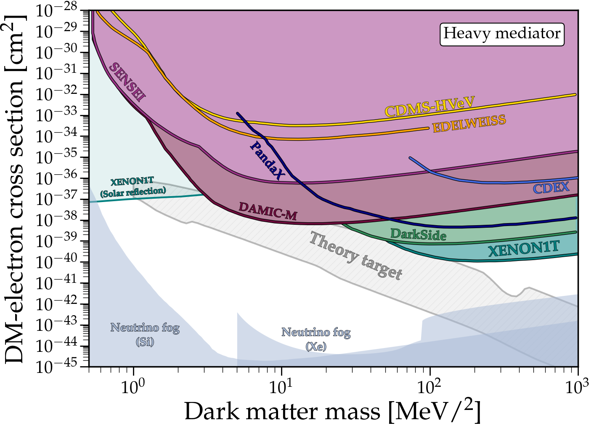

# DirectDetectionPlots

STILL UNDER CONSTRUCTION

Email me if you have comments

---

### DM-nucleon scattering (spin-independent)
### [View Notebook (.ipynb)](https://github.com/cajohare/DirectDetectionPlots/blob/master/notebooks/DM-Nucleon.ipynb)
### [Download (.pdf)](https://raw.githubusercontent.com/cajohare/DirectDetectionPlots/refs/heads/main/plots/Nucleon_SI.pdf)
### [Download (.png)](https://raw.githubusercontent.com/cajohare/DirectDetectionPlots/refs/heads/main/plots/plots_png/Nucleon_SI.png)
### &nbsp;
---

### DM-electron scattering (heavy mediator)
### [View Notebook (.ipynb)](https://github.com/cajohare/DirectDetectionPlots/blob/master/notebooks/DM-Electron.ipynb)
### [Download (.pdf)](https://raw.githubusercontent.com/cajohare/DirectDetectionPlots/refs/heads/main/plots/Electron_LightMediator.pdf)
### [Download (.png)](https://raw.githubusercontent.com/cajohare/DirectDetectionPlots/refs/heads/main/plots/plots_png/Electron_LightMediator.png)
### &nbsp;
---

### DM-electron scattering (light mediator)
### [View Notebook (.ipynb)](https://github.com/cajohare/DirectDetectionPlots/blob/master/notebooks/DM-Electron.ipynb)
### [Download (.pdf)](https://raw.githubusercontent.com/cajohare/DirectDetectionPlots/refs/heads/main/plots/Electron_HeavyMediator.pdf)
### [Download (.png)](https://raw.githubusercontent.com/cajohare/DirectDetectionPlots/refs/heads/main/plots/plots_png/Electron_HeavyMediator.png)
### &nbsp;
---